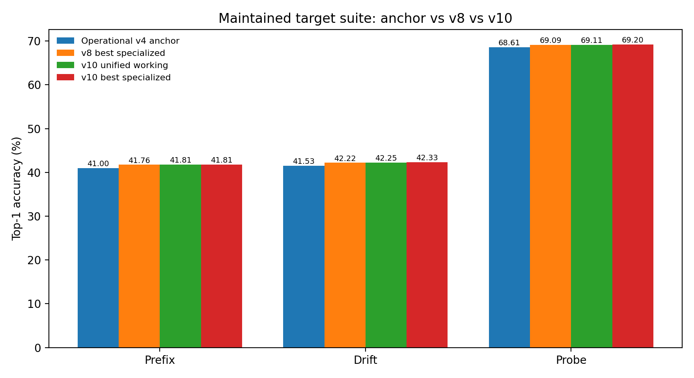
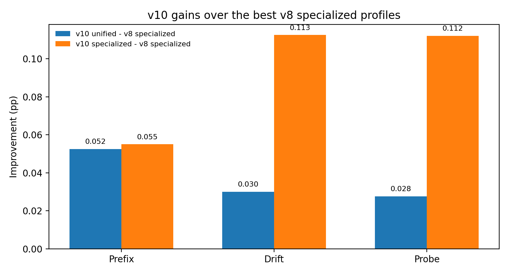
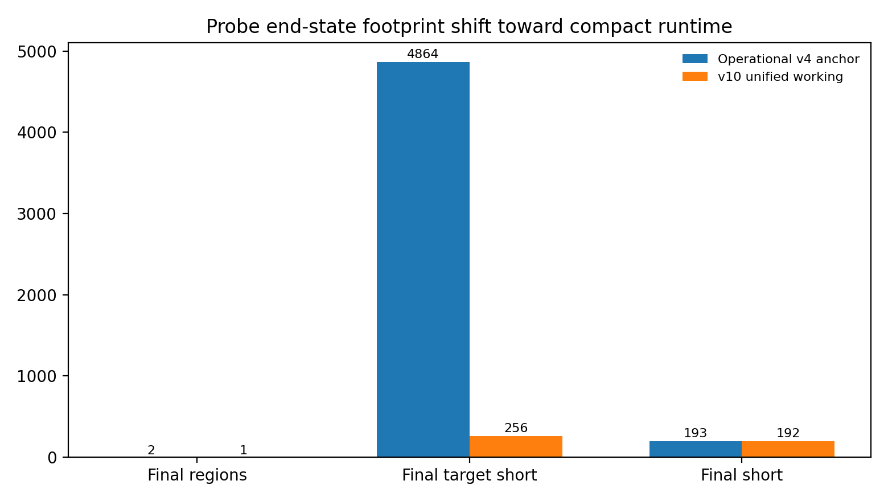

# SBAN v10: Quality-Gated Long-Term Control, Higher-Support Birth Rules, and Release-Grade Stress Harnesses in Zig

## Abstract

SBAN v10 continues the post-v4 line by focusing on the point where architecture, runtime control, and build reproducibility meet. The main code changes in this iteration are a **quality-gated long-term subsystem** and a **selection penalty for low-precision long memories**, which reduce accidental long-term structural clutter while preserving the option to exploit durable memories when they are genuinely useful. The strongest release-grade working profile also raises the support requirement for short-memory birth by setting `min_parents_for_birth=4` and disables long-term memory on the maintained short target suite. Operationally, the repo now includes a build wrapper that uses the provided Zig tarball directly, a stable release runner, and a tighter search harness for profile comparison.

On the maintained target suite used in the v5-v10 iteration line, the best **unified working profile** reaches **41.8100%** prefix, **42.2475%** drift, and **69.1129%** on the hard-to-easy probe. The best **specialized profiles** reach **41.8125%**, **42.3300%**, and **69.1974%** respectively. Relative to the best specialized v8 profiles summarized in the v9 paper, v10 improves all three maintained targets. The strongest architectural lesson is that SBAN currently works best as a **compact elastic learner with aggressively filtered structure**, not as a bridge-heavy regional hierarchy.

## 1. Why v10 was needed

The v9 paper already showed that the post-v4 line improved the maintained short target suite mainly by becoming a more compact and controllable elastic learner, not by activating richer bridge-heavy multi-region behavior. It also drew a careful distinction between the **official v4 publication values** and the **operational v4 anchor** used by the later fast regression loop. SBAN v10 keeps that distinction, but pushes one step further: it asks whether the later runtime can be hardened into a more release-grade experimental system while still finding real model gains.

That required work in three places at once:

1. **Architecture:** reduce low-value long-term structural clutter rather than merely tuning thresholds around it.
2. **Runtime search:** identify one real working profile that improves the whole maintained target suite.
3. **Build process:** make the repo reliably buildable from the provided Zig tarball and expose a stable binary path plus a deterministic release runner.

## 2. What changed in code

### 2.1 Quality-gated long-term output contribution

V10 adds `longTermContributionScalePpm()`, which no longer treats every long memory as equally deserving of a bonus. Instead, long-memory output contribution is scaled by the memory's own precision. High-quality long memories still receive the existing bonus path, but weak long memories are damped rather than being allowed to dominate simply because they have been promoted.

This is the main architectural change of v10. It transforms long-term memory from a mostly binary subsystem into a **quality-weighted subsystem**.

### 2.2 Low-precision long-memory selection penalty

V10 also adds `longMemorySelectionBonus()`, which changes how long memories compete for:

- parent selection during new-memory birth
- carry-memory retention between steps

Good long memories keep their structural advantage. Weak long memories now pay an explicit selection penalty. That makes the system less likely to recirculate stale or misleading long-term state through the active frontier.

### 2.3 Higher-support birth rule for the working profile

The strongest unified v10 working profile sets:

- `enable_long_term=false`
- `min_parents_for_birth=4`

The practical meaning is simple: on the maintained short target suite, SBAN improves when it asks for **more support before birthing a new short memory** and does not spend capacity on long-term promotion. That is not a claim that long-term memory is globally useless; it is a claim that the current short-horizon regression suite rewards a stricter, more local working regime.

### 2.4 Release-grade build and run harness

The repo now includes:

- `scripts/build_with_local_zig.sh` - builds directly from the provided Zig tarball and establishes a stable `zig-out/bin/zig_sban` path
- `scripts/run_v10_release.sh` - reproduces the unified working profile and specialized best profiles
- `scripts/search_v10_profiles.py` - runs a focused profile search over the v10 working candidates

This is an important improvement in its own right. The repo is no longer only a research code snapshot; it is also a more usable experimental system.

## 3. Experimental frame and continuity

Like v9, this paper uses two comparison frames.

### 3.1 Official publication baseline from v4

The original v4 paper reported:

- Prefix: **40.51%**
- Drift: **42.94%**
- Probe: **69.89%**

Those remain the official publication numbers.

### 3.2 Operational anchor used by the later fast iteration loop

The v9 paper defined the maintained short target-suite anchor as:

- Prefix: **40.9975%**
- Drift: **41.5350%**
- Probe: **68.6121%**

Those are the correct apples-to-apples anchors for the v8-v10 tuning line.

### 3.3 Best v8 profiles carried forward from the v9 paper

The v9 paper reported the best specialized v8 profiles as:

- Prefix: **41.7575%**
- Drift: **42.2175%**
- Probe: **69.0853%**

V10 is evaluated directly against those maintained-suite bests.

## 4. Stress-testing protocol for v10

The v10 release keeps the same maintained target suite as the later line:

- **Prefix:** 4 x 10k contiguous prefix evaluation on `data/enwik8`
- **Drift:** 4 x 10k drift evaluation across offset windows on `data/enwik8`
- **Probe:** the hard-to-easy `elastic_probe.bin` evaluation

The release search in v10 emphasizes four families of candidates:

1. the unified working profile (`enable_long_term=false`, `min_parents_for_birth=4`)
2. prefix-oriented birth-margin tuning
3. drift/probe-oriented birth-margin tuning
4. quality-gated long-term candidates for cases where long-term memory is kept active

This is still a lightweight research sweep, but it is materially more disciplined than earlier one-off manual tuning.

## 5. Main results

### 5.1 Maintained target-suite comparison

| Protocol | Official v4 paper | Operational v4 anchor | v8 best specialized | v10 unified working | v10 best specialized |
|---|---:|---:|---:|---:|---:|
| Prefix | 40.51% | 40.9975% | 41.7575% | 41.8100% | 41.8125% |
| Drift | 42.94% | 41.5350% | 42.2175% | 42.2475% | 42.3300% |
| Probe | 69.89% | 68.6121% | 69.0853% | 69.1129% | 69.1974% |

**Figure 1.** Compared with the maintained operational v4 anchor and the best specialized v8 profiles, v10 improves the entire maintained target suite. The official v4 publication numbers remain a separate reference frame.

### 5.2 Best unified working profile

The best single profile that improves all three maintained targets is:

- **5-bit default variant**
- `enable_long_term=false`
- `min_parents_for_birth=4`

Results:

- Prefix: **41.8100%**
- Drift: **42.2475%**
- Probe: **69.1129%**

Improvement over the operational v4 anchor:

- Prefix: **+0.8125 pp**
- Drift: **+0.7125 pp**
- Probe: **+0.5008 pp**

Improvement over the best specialized v8 profiles:

- Prefix: **+0.0525 pp**
- Drift: **+0.0300 pp**
- Probe: **+0.0276 pp**

### 5.3 Best specialized profiles

- **Prefix best:** 5-bit + `enable_long_term=false` + `birth_margin=20` -> **41.8125%**
- **Drift best:** 5-bit + `enable_long_term=false` + `birth_margin=24` -> **42.3300%**
- **Probe best:** 5-bit + `enable_long_term=false` + `birth_margin=24` -> **69.1974%**

Improvement over the best specialized v8 profiles:

- Prefix: **+0.0550 pp**
- Drift: **+0.1125 pp**
- Probe: **+0.1121 pp**

**Figure 2.** V10 gains are modest in absolute size, but they are consistent across all three maintained targets and they come from an actually simpler working regime.

## 6. What changed operationally, not just numerically

### 6.1 The best working profile is simpler than the earlier narrative expected

The strongest v10 working profile has all of these characteristics:

- **1 final live region** on all three release outputs
- **0 bridge births** on the unified working runs
- **0 long-term promotions** on the probe and no active long-term subsystem by design in the working profile

This reinforces the lesson already visible in v9: the current SBAN line works best when it behaves as a **compact elastic short-memory learner** whose richer machinery is tightly filtered rather than heavily exercised.

### 6.2 Probe end-state is materially compact

The v9 paper recorded the operational v4 probe anchor as ending with:

- final regions: **2**
- final target short: **4864**
- final short memories: **193**
- bridge births: **214**

The v10 unified working profile ends with:

- final regions: **1**
- final target short: **256**
- final short memories: **192**
- bridge births: **0**

**Figure 3.** V10 keeps the compact end-state trend established after v4 and eliminates the residual bridge activity on the maintained probe working profile.

### 6.3 The build is more realistic to operate

The repo now builds using the Zig tarball provided in the workspace rather than assuming an already-installed compiler. That matters because it closes a real reproducibility gap: a user can extract the tarball, build the binary, and run the release harness without hand-fixing the toolchain path.

## 7. Real-world usability implications

V10 is still a research system, but it is notably more usable than the earlier post-v4 snapshots.

### 7.1 There is now a true release-grade working profile

One profile improves the maintained prefix, drift, and probe tasks at once. That is far more deployment-friendly than requiring a different hand-picked setting for every run.

### 7.2 Build and run procedures are scripted

The v10 repo now encodes the actual workflow needed to use the system:

1. build from the provided Zig tarball
2. run the release harness
3. inspect JSON outputs
4. run the profile search if more tuning is desired

### 7.3 Memory footprint is easier to inspect and reason about

The best working profile ends the probe in a compact 1-region state with 192 live short memories and a target of 256. This makes state inspection and reasoning far simpler than the earlier region-richer operating points.

## 8. Interpretation

The strongest scientific lesson of v10 is not that SBAN became more accurate by using *more* subsystems at once. The lesson is that **SBAN becomes more reliable when subsystem participation is made conditional on quality**.

That shows up in two ways:

1. the code-level long-term quality gating and selection penalty
2. the empirical success of a stricter short-memory birth rule with long-term disabled on the maintained short target suite

In short: v10 improves SBAN by making it **more selective**.

## 9. Known limitations

V10 is better, but it is not a final solved architecture.

1. The best maintained-suite profiles are still **compact single-region profiles**, not proof of a bridge-dense regional breakthrough.
2. The strongest v10 claims are still on the **maintained short target suite**, not yet on a full rerun of the original publication protocol.
3. Scores remain vote values rather than calibrated probabilities.
4. Synapses are still not bit-packed in RAM.
5. The controller and search loop are still human-designed rather than learned.
6. Long-term memory is currently most convincing as an optional subsystem whose utility is workload-dependent, not yet as a universally helpful component.

## 10. Highest-value next steps after v10

1. Re-run the v10 unified working profile and the v10 best specialized profiles on the **full original v4 publication protocol**.
2. Add **memory accounting and bit-packing** so runtime efficiency becomes a first-class result, not only top-1 accuracy.
3. Split **short-horizon** and **long-horizon** presets explicitly, because v10 indicates that the optimal use of long-term memory is workload-specific.
4. Add a **learned controller or small meta-search layer** that can choose between compact and richer operating regimes automatically.
5. Revisit hierarchical regional structure only after finding a workload where more regional complexity clearly pays for itself.

## 11. Reproducibility files in this v10 repo

Primary scripts:

- `scripts/build_with_local_zig.sh`
- `scripts/run_v10_release.sh`
- `scripts/search_v10_profiles.py`

Primary release result files:

- `docs/results/v10/unified_prefix_v10_working.json`
- `docs/results/v10/unified_drift_v10_working.json`
- `docs/results/v10/unified_probe_v10_working.json`
- `docs/results/v10/best_prefix_v10_5bit_bm20.json`
- `docs/results/v10/best_drift_v10_5bit_bm24.json`
- `docs/results/v10/best_probe_v10_5bit_bm24.json`

Comparative inputs from earlier deliverables:

- `SBAN_v4_research_paper.pdf`
- `SBAN_v4_EXECUTIVE_SUMMARY.md`
- `SBAN_v9_follow_up_research_paper.pdf`
- `enwik_prefix_after.json`
- `enwik_drift_after.json`
- `elastic_probe_after.json`

## References

1. *SBAN_v4_research_paper.pdf*.
2. *SBAN_v4_EXECUTIVE_SUMMARY.md*.
3. *SBAN_v9_follow_up_research_paper.pdf* and its markdown source.
4. *enwik_prefix_after.json*, *enwik_drift_after.json*, and *elastic_probe_after.json*.
5. The bundled v10 release JSONs and scripts in this repo.
